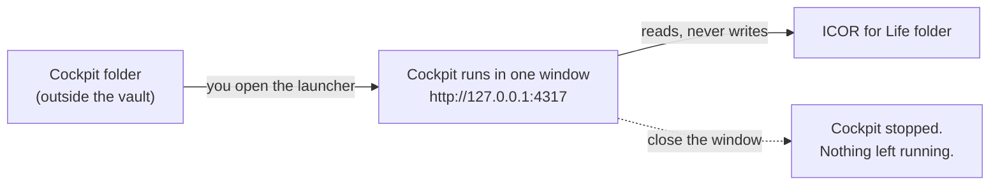

# Install the ICOR for Life - Cockpit

This guide is written so that your own AI assistant (Claude Code, Codex, Cursor, Gemini or any
assistant that can run commands on your computer) can install the Cockpit for you, step by step.
You can also follow it yourself: every step is one command.

**If you are the assistant:** read the whole file first, then work through it in order. Tell the
person what each step does before you run it, and wait for a yes where a step says **Ask**.

## What you get, and what you never get



- The Cockpit runs only while its window is open. Close the window and it is stopped.
- The install creates **no** login item, launch agent, launch daemon, startup entry, scheduled task,
  cron job or background service, on any operating system. Nothing starts by itself, ever.
- It never writes into your notes. The only file it writes is `cockpit.settings.json` (your two
  folder paths) inside the Cockpit folder.
- It listens on `127.0.0.1` only, so no other computer can reach it.

## Rules for the assistant

1. Never create anything that starts by itself: no `launchctl`, no files in `LaunchAgents` or
   `LaunchDaemons`, no login items, no `crontab`, no `systemctl enable`, no Windows Startup folder,
   Run key or `schtasks`. If the person asks for the Cockpit to start at login, explain that this
   release does not do that and stop there.
2. Never use `sudo` or an administrator prompt. Nothing here needs it.
3. Never put the Cockpit folder inside the person's ICOR for Life folder, and never change a file
   inside that folder.
4. Do not leave the Cockpit running in the background. The person starts it with the launcher. If
   you start it yourself to test, run it in the foreground and stop it within a minute (`Ctrl+C`).
5. If a step fails, try its "If it fails" line once. If it still fails, stop and show the person
   the exact error. Do not invent a workaround.

## Step 1. Read the disclaimer

Open [DISCLAIMER.md](./DISCLAIMER.md) and give the person its gist in two sentences.

**Ask:** "Shall I install the Cockpit?"

## Step 2. Check Node.js

```bash
node --version
```

It must print `v20` or newer.

If it fails (no Node.js, or older than 20): the person installs the current LTS from
<https://nodejs.org> (the normal installer, no `sudo` from you), then opens a new terminal. Run the
check again.

## Step 3. Put the Cockpit folder in place

**Ask:** "Where should the Cockpit folder live?" Suggest `~/Apps/icor-for-life-cockpit` on macOS
and Linux, `%USERPROFILE%\Apps\icor-for-life-cockpit` on Windows. It must be **outside** the
ICOR for Life folder.

Get the files from the release page of `myICOR/icor-for-life-cockpit` (download the source zip of
the latest release and unzip it there), or clone the repository into that folder. Then go into it:

```bash
cd ~/Apps/icor-for-life-cockpit
npm run check:node
```

`check:node` must print `Node.js ... OK`.

The folder path must not contain any of these characters: `` " $ ` \ % ! & | < > ^ `` (a launcher
cannot carry them safely). If it does, move the folder to a plainer path.

## Step 4. Take the "before" snapshot

This records every place your computer starts programs from, so Step 8 can prove the install
added nothing there. It only reads; it changes nothing.

```bash
node scripts/check-no-autostart.mjs snapshot ../cockpit-autostart-before.json
```

## Step 5. Install and build

```bash
npm run install:all
npm run build
```

`install:all` runs `npm ci` for the server and for the web app: it installs exactly the versions
in the lockfiles, nothing newer. `build` creates `web/dist`.

If it fails: run `npm cache verify`, then the two commands once more. A message about the engine
or `EBADENGINE` means Node.js is too old: go back to Step 2.

## Step 6. Make the launcher

**Ask:** "Where do you want the start file? Your Desktop?"

```bash
npm run launcher -- --out ~/Desktop
```

On Windows use `--out "%USERPROFILE%\Desktop"`. Without `--out`, the file goes to `launchers/`
inside the Cockpit folder.

This writes one file:

| System | File | How to start it |
|---|---|---|
| macOS | `Start ICOR for Life Cockpit.command` | double-click (opens Terminal) |
| Linux | `start-icor-for-life-cockpit.sh` | `sh "<file>"` in a terminal |
| Windows | `Start ICOR for Life Cockpit.cmd` | double-click |

The launcher is the readable template in `launcher/` with three values filled in: the Cockpit
folder, the port and the version. Show the person the file; it is short. The script refuses to
write into any folder the system starts programs from, so the launcher can never become a
login item by accident.

Port `4317` taken by something else? Make the launcher again with `--port 4417` (any number from
1024 to 65535).

## Step 7. First start

The person opens the launcher. A window shows:

```
  ICOR for Life - Cockpit v2.0.0
  serving:  http://127.0.0.1:4317  (loopback only, read-only)
```

The browser opens that address after two seconds. In the Cockpit, go to **Settings** and enter:

- **ICOR for Life folder**: the absolute path of the vault. Required.
- **Agents folder**: optional. The same folder (if the AI team lives inside the vault) or a
  separate folder with `AGENTS.md` and `06 AI Team/`.

Save. The Cockpit reads both folders and follows changes made in Obsidian within a second.

To stop it: close the window, or press `Ctrl+C` in it.

## Step 8. Prove that nothing starts by itself

After the Cockpit is stopped:

```bash
node scripts/check-no-autostart.mjs compare ../cockpit-autostart-before.json
```

It must print `PASS`. Lines marked `changed, not ours` are the computer's own services coming and
going; they do not mention the Cockpit. If it prints `FAIL`, show the person the listed entry
and stop.

On macOS, add `--login-items` to both the snapshot and the compare to include the login items list
as well (macOS may ask once for permission to read it).

Then: **log out and log back in** (or restart). The Cockpit must not be running
(`http://127.0.0.1:4317` does not open) until the person opens the launcher again.

Last, delete the snapshot: `../cockpit-autostart-before.json` lists your computer's startup
entries and is not needed any more.

## Updating

1. Stop the Cockpit.
2. Keep `cockpit.settings.json`. Replace everything else in the folder with the new release.
3. Run Step 5 again, then Step 6 again (it overwrites the old launcher).

## Uninstalling

1. Stop the Cockpit.
2. Delete the Cockpit folder and the launcher file.

That is all. There is no service to unregister and nothing in your notes to clean up.

## Help

- Something in the Cockpit looks wrong: [README.md](./README.md).
- A security problem: [SECURITY.md](./SECURITY.md).
