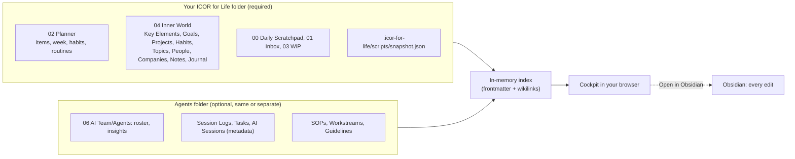

# ICOR for Life - Cockpit

A local, read-only window onto your ICOR for Life folder: your knowledge and the
tasks in your Planner, on one screen in your browser. Connect a second folder (or
the same one) and it also shows your AI team: the agents, what they learned, their
session logs, their tasks and the analytics.

Version 2.0.0. MIT licence. Runs on your machine only (`127.0.0.1`), never writes
to your notes, and needs no database.

## What it shows



| Area | Views |
|---|---|
| Overview | Dashboard (today, this week, your life snapshot, buckets, latest journal and notes, on this day), Journal timeline, Planner week board, Inbox, Work in progress |
| Knowledge | Key Elements, Goals, Projects, Habits, Topics, People, Companies, Notes, Documents; every note with its links, backlinks and a small graph |
| My AI Team (optional) | Roster, Insights, Session Log, Tasks, Analytics, SOPs, Workstreams, Guidelines |

The Cockpit reads the fields and paths of the `icor-concepts/1` schema, vendored
byte-identical from myPKA 6.0.1 under `schema/` and pinned by sha256.

## Requirements

- Node.js 20 or newer.
- An ICOR for Life folder (2.0.0 layout; an older folder with the `02 Planner` and
  `04 Inner World` rooms works and is marked "unverified").
- Optional: a myPKA folder with `AGENTS.md` and `06 AI Team/`.

## Install and run

```bash
npm run install:all   # server and web dependencies
npm run build         # builds the web app into web/dist
npm start             # serves http://127.0.0.1:4317
```

Open `http://127.0.0.1:4317`, go to **Settings**, and enter the absolute path of
your ICOR for Life folder, and optionally the agents folder. The Cockpit re-reads
both folders within a second of any change you make in Obsidian.

Nothing starts by itself: there is no login item and no background service. You
start the Cockpit when you want it and stop it with `Ctrl+C`. A step-by-step
guide for your own AI assistant is in [INSTALL.md](./INSTALL.md).

### Settings and environment

| Setting | Where | Purpose |
|---|---|---|
| ICOR for Life folder | Settings, or `ICOR_CONTENT_ROOT` | Required. Absolute path of your vault |
| Agents folder | Settings, or `ICOR_AGENTS_ROOT` | Optional. Same folder (mode A) or a separate one (mode B) |
| Port | `PORT` | Default `4317` |
| Settings file | `COCKPIT_SETTINGS_FILE` | Default `cockpit.settings.json` in this folder |

Environment variables win over the Settings page. The settings file holds only the
two paths and lives in the Cockpit folder, never inside a vault.

## Read-only by design

- Every data route is a `GET`. The only write is the Cockpit's own settings file.
- Every file path is jailed to its folder (`path.relative` containment after
  `realpath`); dot folders, `.env*`, `.mcp.json`, `07 Databases` and AI Session
  transcripts are never served.
- The server binds `127.0.0.1` only and refuses a foreign `Host` header.
- Planning, checking off and editing happen in Obsidian: every card and note has an
  "Open in Obsidian" link.

Note for streamers: the Cockpit shows your private notes. Close it or switch views
before you share your screen.

## Develop

```bash
npm test              # schema pin check + server tests (node:test)
npm run dev:web       # Vite dev server for the web app (proxy to a running server)
```

Tests run against generic fixture folders in `test/fixtures/` (an ICOR for Life
folder and a separate agents folder), including the jail, the no-write guarantee
and the DNS-rebinding guard.

Adding a view: add a `GET` route in `server/app.js` that reads the index, a view in
`web/src/views/`, and one entry in `web/src/lib/moduleRegistry.tsx`.

## Licence

MIT, see [LICENSE](./LICENSE). Third-party notices: [NOTICE](./NOTICE).
Security reports: [SECURITY.md](./SECURITY.md).
